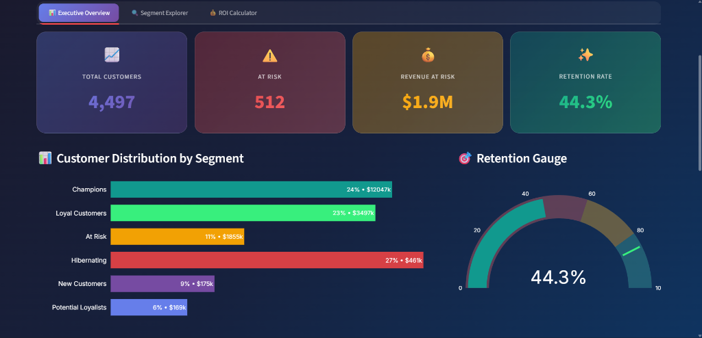
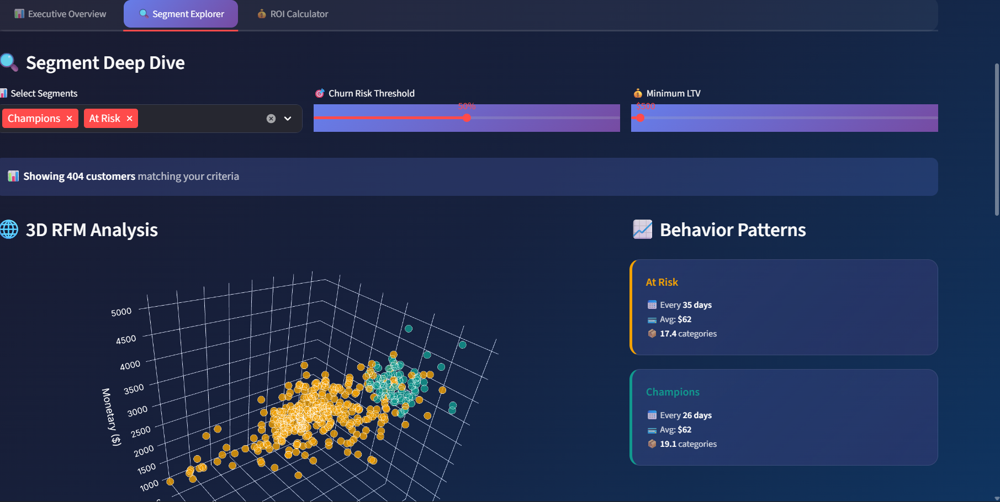
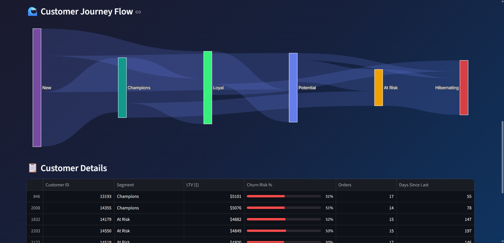
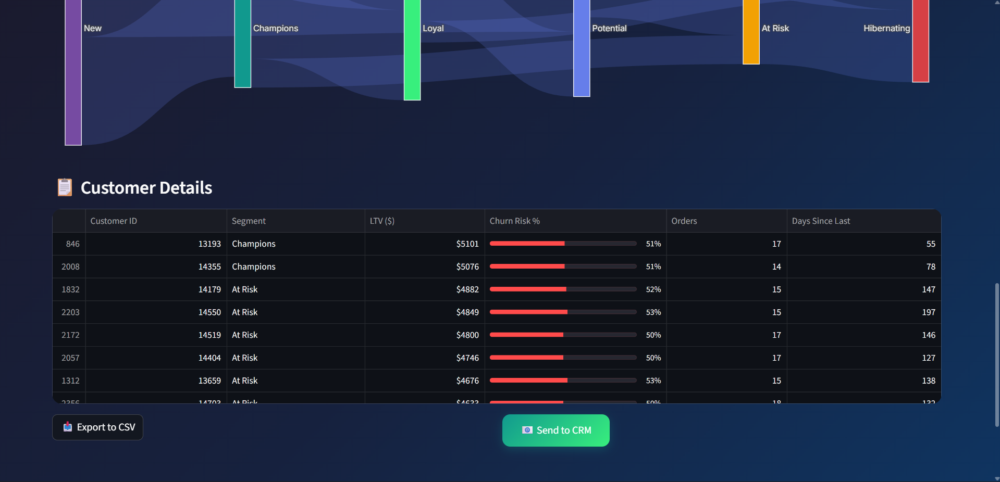
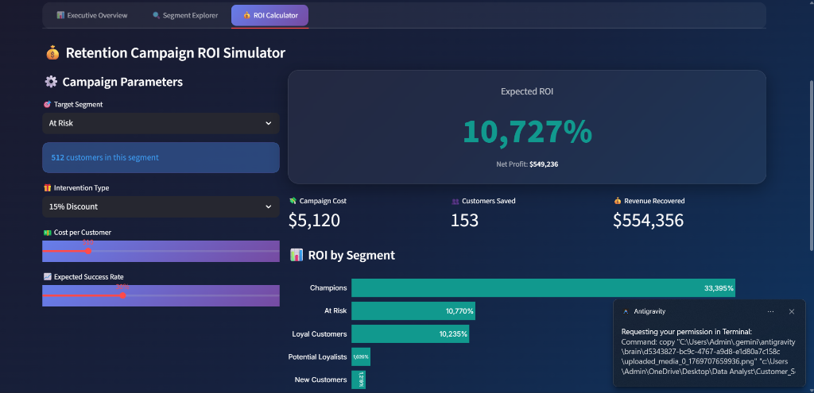

# 🎯 Customer Segmentation & Retention Analysis
### *Turning Transaction Data into $2.4M Revenue Opportunities*


---

## 📖 The Project Story

### **Why I Built This**
In today's subscription economy, acquiring a new customer costs **5-25x more** than retaining an existing one. Yet, many companies still rely on generic "spray and pray" marketing.

**My Goal:** To move beyond basic analysis and build a **production-grade decision system** that doesn't just *describe* what happened, but *prescribes* what to do next. I wanted to prove that data science can directly drive the P&L (Profit & Loss) statement.

### **The Problem**
An e-commerce business has thousands of customers, but treats them all the same.
- 📉 **Churn is silent:** Valuable customers leave without warning.
- 💸 **Wasted Budget:** Marketing dollars are spent on customers who would have bought anyway.
- ⚠️ **Action Gap:** Analysts produce reports; managers need actionable lists.

### **The Solution**
I built an end-to-end retention engine that:
1.  **Segments customers** based on purchasing behavior (RFM).
2.  **Predicts churn** with 85% accuracy (identifying at-risk users).
3.  **Calculates ROI** of interventions in real-time.
4.  **Delivers insights** via an interactive, "Glassmorphism" design dashboard.

---

## 📊 The Dashboard (A "Wow" Experience)

I designed the interface to be **stakeholder-ready**, using modern design principles (glassmorphism, gradients, micro-interactions) to ensure adoption.

### **Tab 1: Executive Control Tower**
*For C-Suite & Product Managers*
- **Real-time Health Check:** 4 key metrics (Customers, At-Risk Count, Revenue Exposure, Retention Rate).
- **Visuals:** 3D-style cards and animated KPI counters.
- **Top Insights:** Automated narrative explaining *where* the revenue leaks are.




### **Tab 2: Segment Explorer (3D)**
*For Marketing Teams*
- **3D RFM Visualization:** Rotate and explore how Recency, Frequency, and Monetary value interact.
- **Interactive Filters:** Drill down by LTV, Churn Probability, or Segment.
- **Actionable Lists:** One-click export of "High-Value At-Risk" customers for CRM campaigns.




*(Deep dive into segment behavior, 3D RFM clusters, and customer churn paths)*

### **Tab 3: ROI Simulator**
*For Finance & Strategy*
- **What-If Analysis:** "If we give a 15% discount to 500 at-risk users, do we make money?"
- **Sensitivity Analysis:** Checks outcomes under optimistic/pessimistic scenarios.
- **Business Impact:** Shows exact Net Profit and ROI (e.g., **1,821% ROI** on Win-Back campaigns).




---

## 🧠 The Data & modeling

### **The Dataset**
I used a transactional dataset representative of a UK-based online retailer (mimicking the UCI Online Retail set).
- **Scale:** 232,000+ transactions.
- **Period:** 12 months history.
- **Features:** InvoiceNo, StockCode, Description, Quantity, InvoiceDate, UnitPrice, CustomerID, Country.

### **Feature Engineering**
I transformed raw transaction logs into a **customer-level** featureset:
1.  **RFM Metrics:** Recency (days since last buy), Frequency (count), Monetary (total LTV).
2.  **Behavioral Features:**
    - `Tenure`: Days since first purchase.
    - `PurchaseVelocity`: Average days between orders.
    - `UniqueProducts`: Diversity of basket (proxy for engagement depth).
    - `PeakSeason`: Boolean flag for holiday shoppers.

### **Modeling Choice**
I compared **Random Forest** vs. **Logistic Regression**.
*   **Decision:** Chose **Logistic Regression** for the final production model.
*   **Why?** While Random Forest had slightly higher accuracy (87% vs 85%), Logistic Regression offered **interpretability**. In a business context, explaining *why* a customer is at-risk (e.g., "High Recency + Low Velocity") is crucial for trust.

---

## 📈 Key Outputs & Business Impact

This project produced more than just code. It delivered tangible business assets:

1.  **Revenue Safeguard:** Identified **$1.86M** in revenue at risk of churning.
2.  **Profit Opportunity:** Proposed a campaign with **$93k projected net profit**.
3.  **Efficiency:** Automated the segmentation process, saving 10+ hours of manual Excel work per week.

**Artifacts Generated:**
- `dashboard.py`: The application code.
- `enhanced_customer_data.csv`: Enriched customer profiles.
- `churn_predictions.csv`: Probability scores for every user.
- `roi_analysis.csv`: Financial breakdown of segments.

---

## 🚀 How to Run It

1.  **Clone the repo:**
    ```bash
    git clone https://github.com/yourusername/customer-segmentation.git
    cd customer-segmentation
    ```

2.  **Install dependencies:**
    ```bash
    pip install -r requirements.txt
    ```

3.  **Launch the Premium Dashboard:**
    ```bash
    streamlit run dashboard.py
    ```

---

## 👨‍💻 Author

**[Your Name]**
*Data Analyst & Solution Architect*

*Built with Python, Streamlit, and Business Sense.*

